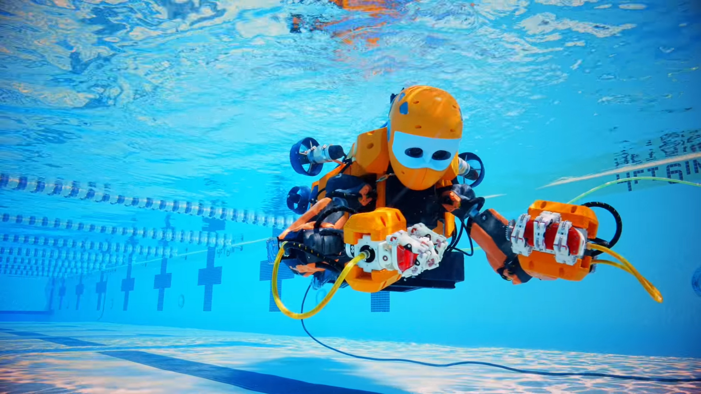
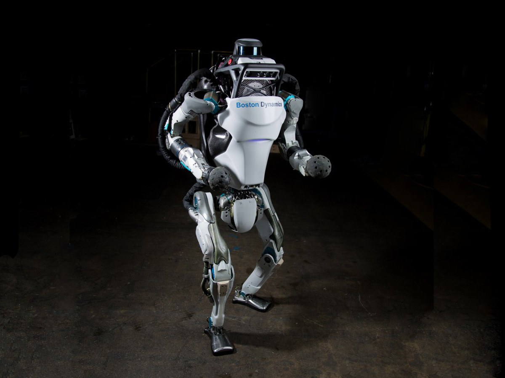

# humanoid-robots
A humanoid robot is a robot with its body shape built to resemble the human body. The design may be for functional purposes, such as interacting with human tools and environments, for experimental purposes, such as the study of bipedal locomotion, or for other purposes.
## 7 Popular Humanoid Robots Designed With Closest Semblance To Humans
# 1.OCEAN ONE:
A bimanual underwater humanoid robot created by the Stanford Robotics Lab to explore coral reefs, Ocean One can reach depths that most human beings cannot. It is a perfect synergy of robotics, haptic feedback systems and artificial intelligence. 
[Image of ocean Humanoid](https://images.app.goo.gl/4Ziz4QEr5kSEDfvg9)

# 2.ATLAS:
Described as “the world’s most dynamic humanoid” by its creators, ATLAS was unveiled in 2013. It was built to carry out search and rescue missions and was developed by Boston Dynamics with funding and supervision from the United States Defense Advanced Research Projects Agency (DARPA). It can navigate its way through tough terrain and obstacles in its path using its range sensing, stereo vision, and other sensors.
[Image of ATLAS Humanoid](https://images.app.goo.gl/2NXbntdyjedcyLsh9)

# 3.NAO:
Imagine a soccer match with adorable baby-sized robots on both sides. Sounds cute, doesn’t it? Nao, the 23 inch robot has an entire event, RoboCup Standard Platform League, dedicated to it as a part of Robocup.
[Image of Nao Humanoid](https://images.app.goo.gl/7iPBgSRNXetQXDah9)

Protection Ensemble Test Mannequin or ‘Petman’ for short, is another creation by Boston Dynamics. It was funded by US Department of Defense’s Chemical and Biological Defense program,and was developed to test biological  and chemical suits for the US military.
[Image of Petman humanoid](https://images.app.goo.gl/D3ood7xkSHF9uoBT9)

# 5.ROBEAR
or those who loved the adorable robot healthcare provider Baymax from the superhero movie Big Hero 6 (2014), there is an equally adorable real-life equivalent in Robear. Robear is the very definition of a ‘machine with a gentle touch’. Developed by scientists from RIKEN and Sumitomo Riko Company Limited, this experimental robot was considered as a possible solution to the problem of increasing shortage of caregivers that Japan is set to witness over the course of this century.
[Image pf Robear humanoid](https://images.app.goo.gl/A9481tjSJ1RQ4wVA6)

# 6.PEPPER
There could be nothing cooler than a robot that can read primary human emotions  such as anger, joy or sadness and ‘behave’ accordingly. No robot does it better than Pepper. It was  built by SoftBank Robotics to serve as humanoid companion who can communicate in a natural and intuitive manner.
[Image of Pepper Humanoid]()

# 7.SOPHIA
Said to be modelled on Hollywood legend Audrey Hepburn, Sophia was developed by roboticist David Hanson and his company Hanson Robotics. She was activated in April 2015 and came to international renown in October 2017 after she was granted citizenship by the Kingdom of Saudi Arabia.
[Image of Sophia Humanoid]()

